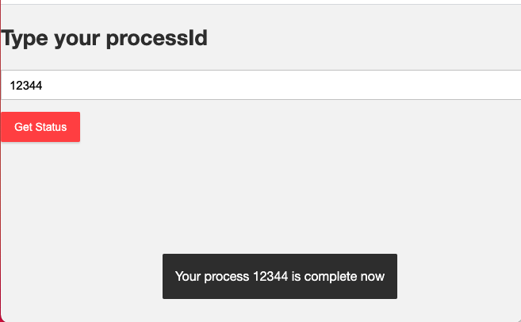

## Spring Boot WebSocket Process checker (with process specific messages)



## Requirements

1. Java - 1.8.x

2. Maven - 3.x.x

## Steps to Setup

**1. Clone the application**

```bash
git clone https://github.com/hariohmprasath/spring-boot-websocket-chat-demo-master.git
```

**2. Build and run the app using maven**

```bash
cd spring-boot-websocket-private-message-demo
mvn package
java -jar target/spring-boot-websocket-private-message-demo-0.0.1-SNAPSHOT.jar
```

Alternatively, you can run the app directly without packaging it like so -

```bash
mvn spring-boot:run
```

**3. Build docker image**

Docker file is available under root directory, run the following command to generate a docker image out of this application

```bash
docker build -t demo .
```
